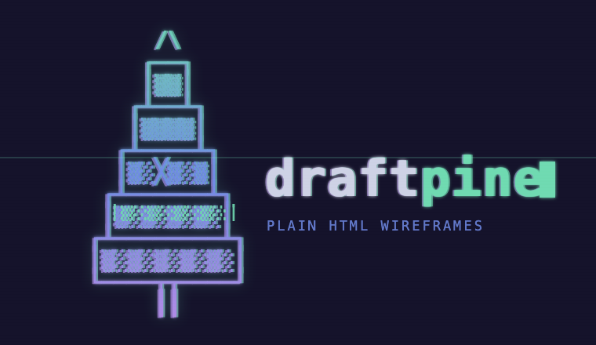

<p align="center">
  
</p>

<p align="center">
  <strong>Wireframes your coding agent can actually build.</strong><br>
  Plain HTML + Pico + Alpine prototypes — no build step, no framework, deployable to GitHub Pages.
</p>

<p align="center">
  <code>plain HTML</code> · <code>Pico CSS</code> · <code>Alpine.js</code> · <code>no build tools</code> · <code>GitHub Pages</code>
</p>

---

Hand a coding agent a vague "make me a billing dashboard" and it tends to reach for React, a bundler, and an afternoon of setup. Draftpine removes that temptation. It's a small, opinionated workspace that gives the agent strict rules, ready-made templates, and a checker that tells it exactly what to fix — so you get a throwaway prototype in one pass, not a half-built app.

You bring the product idea. Draftpine handles the guardrails.

## Quickstart

**1. Paste this into your coding agent to set up the project:**

```text
Clone https://github.com/nibzard/draftpine into a new folder and set it up so we can start
prototyping wireframes. Read AGENTS.md to learn the rules, run `python3 scripts/check.py --json`
to confirm the starter passes, start a local preview at http://localhost:5173, then ask me which
screen to build first.
```

The agent clones the repo, reads the contract, verifies the checker is green, and serves the starter wireframe locally. You're now ready to prototype.

**2. Whenever you want a screen, describe it:**

```text
Build a wireframe:
Screen:        Usage billing dashboard
Audience:      startup founder
User goal:     understand current usage before upgrading
Primary action: upgrade plan
Sections:      summary cards, usage chart placeholder, invoices table, plan comparison
States:        default, empty invoices, over-limit warning, success
Interactions:  tabs, modal, filter invoices
Skip:          auth, backend calls, real chart library
```

The agent picks the closest template, edits the four root files, and loops on the checker until it passes. Refine, add screens, or ask it to deploy when you're happy.

## How it works

```text
your prompt
  → agent reads AGENTS.md            (the rules)
  → agent picks a template/          (a close starting point)
  → agent edits index.html, styles.css, app.js, draftpine.config.json
  → python3 scripts/check.py --json  (structured pass/fail + fixes)
  → agent loops until status: pass
  → deploy to GitHub Pages           (only when you ask)
```

Only `index.html`, `styles.css`, `app.js`, and `draftpine.config.json` change per screen. Everything else is the kit.

## Preview locally

```bash
python3 -m http.server 5173
# open http://localhost:5173
```

## The checker

`scripts/check.py` is built for agents: it returns prioritized, machine-readable repairs instead of prose.

```bash
python3 scripts/check.py --json
```

```json
{
  "status": "fail",
  "summary": { "errors": 1, "warnings": 0, "passes": 12 },
  "next_actions": [
    {
      "priority": 1,
      "rule": "required-state.empty",
      "file": "index.html",
      "message": "Required state 'empty' is missing.",
      "suggested_fix": "Add an element with data-draftpine-state=\"empty\"."
    }
  ]
}
```

The agent works the `next_actions` list until `"status": "pass"`. The checker enforces the stack rules below, required states/interactions from `draftpine.config.json`, semantic landmarks, and basic accessibility (button and form labels).

Extra modes:

```bash
python3 scripts/check.py --templates --json   # verify each template's metadata matches its markup
python3 -m unittest discover -s tests          # run the checker's tests (stdlib only)
```

## Deploy to GitHub Pages

Ask the agent to deploy, and it runs:

```bash
python3 scripts/deploy_pages.py --branch main --path /
```

The script refuses to publish unless `git`, `gh`, GitHub auth, an `origin` remote, and a passing check are all in place, then enables or updates Pages and prints the live URL.

## Stack rules

- Plain HTML, CSS, and JavaScript only.
- Pico CSS v2 and Alpine.js v3, both from a CDN.
- No npm, React, Vue, Svelte, Tailwind, TypeScript, bundlers, routers, backend calls, or chart libraries.
- Custom CSS stays small — layout, spacing, and density, not a design system.

## Markers

Lightweight `data-draftpine-*` attributes let the checker judge intent without parsing your design:

```html
<button data-draftpine-action="primary">Upgrade plan</button>
<section data-draftpine-state="empty">…</section>
<section data-draftpine-state="success">…</section>
<div data-draftpine-interaction="filter">…</div>
<dialog data-draftpine-interaction="modal">…</dialog>
```

Which states and interactions are required is declared in `draftpine.config.json`.

## Templates

Start from the closest template instead of inventing a layout:

| Template | Use it for |
| --- | --- |
| `billing` | usage, invoices, subscriptions, plan upgrades |
| `dashboard` | metrics, reporting, status, operational overviews |
| `crm-pipeline` | deal flow, stages, sales workflows |
| `onboarding` | setup, activation, checklists, invites |

## Repo layout

```text
AGENTS.md            agent contract (read first); CLAUDE.md mirrors it for Claude Code
index.html · styles.css · app.js · draftpine.config.json   the wireframe you edit
scripts/             check.py (the checker) · deploy_pages.py (Pages publish)
tests/               stdlib unit tests for the checker
templates/           billing · dashboard · crm-pipeline · onboarding
schemas/             JSON schemas for the screen packet and config
agent-workflows/     step-by-step playbooks; .claude/skills/ mirrors them
```

---

Draftpine is not a frontend framework. It's a constrained workspace for fast product thinking with coding agents — built to be thrown away and rebuilt as the idea changes.
